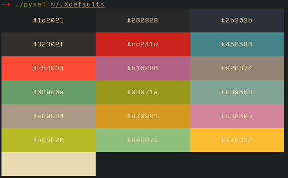

## Pyxel
A small python script to show the colors in a text file to a true-color capable terminal.

Pyxel will read over files provided as input in order to extract and display
squares of color for each one. These squares are ordered, and thus require
complete parsing of the input before they can be displayed.

Pyxel requires a true-color capable terminal to function properly. There are a
number of such terminals, including KDE's Konsole, iTerm2, all VTE-based terminals,
and st. This notably excludes urxvt and putty.

Pyxel is currently python2 and python3 compatible. This may change in the
future if any interesting new features are python3 only.

#### Examples
Pyxel slurps all files provided to it. All of the following examples should work:
```
> pyxel < ~/.Xdefaults
> echo "#AAA#BBB#CCC #DDD" | pyxel
> echo "#AAA#BBB#CCC #DDD" | pyxel -
> pyxel ~/.Xdefaults
> pyxel ~/.Xdefaults ~/.vim/bundle/gruvbox/gruvbox.vim
```

#### Screenshots


#### Attribution
Pyxel is directly inspired by l3ib's [rainbow](http://projects.l3ib.org/rainbow/)
utility. I didn't like the Ruby dependency, so I decided to reimplement in
Python3 (though I never read Rainbow's code, so any similarities are purely
coincedental and likely unavoidable). I then rediscovered how much of a pain
UI programming can be and decided to implement as a modern terminal application
rather than via one of the numerous UI toolkits available in Python.
